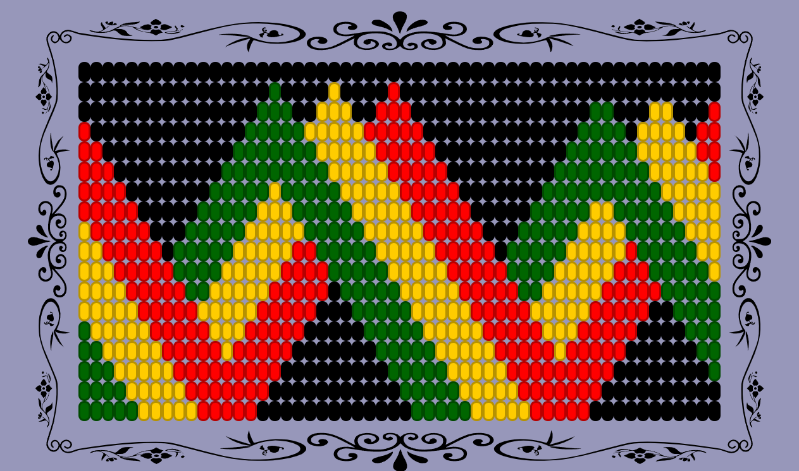
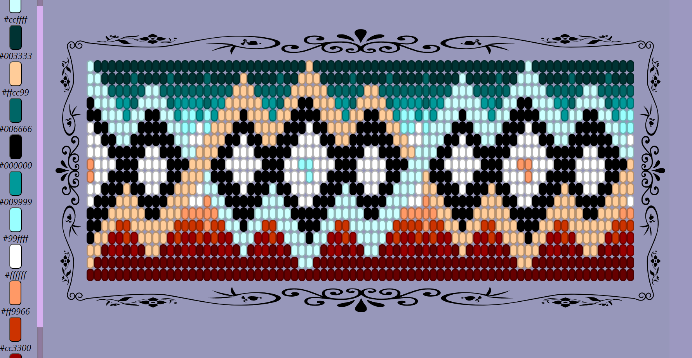
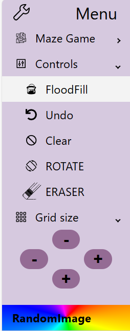
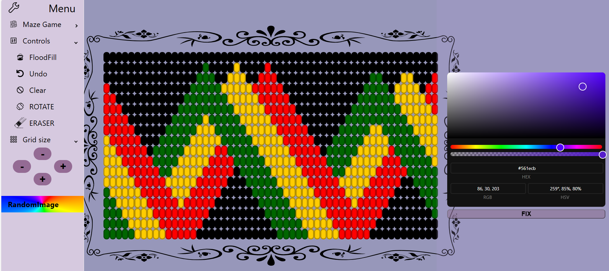

# Beads editor
An easy and simple editor for making bracelets or necklaces using colored beads.

## React-pro-sidebar
As tools it use [React-pro-sidebar](https://www.npmjs.com/package/react-pro-sidebar)
with a maze minigame being able to construct a maze and run it with dijkstra algorithm to find the solution

## Available Scripts

In the project directory, you can run:

### `npm start`

Runs the app in the development mode.\
Open [http://localhost:3000](http://localhost:3000) to view it in the browser.

The page will reload if you make edits.\
You will also see any lint errors in the console.

# Getting Started with Create React App

This project was bootstrapped with [Create React App](https://github.com/facebook/create-react-app).
You can learn more in the [Create React App documentation](https://facebook.github.io/create-react-app/docs/getting-started).

To learn React, check out the [React documentation](https://reactjs.org/).
